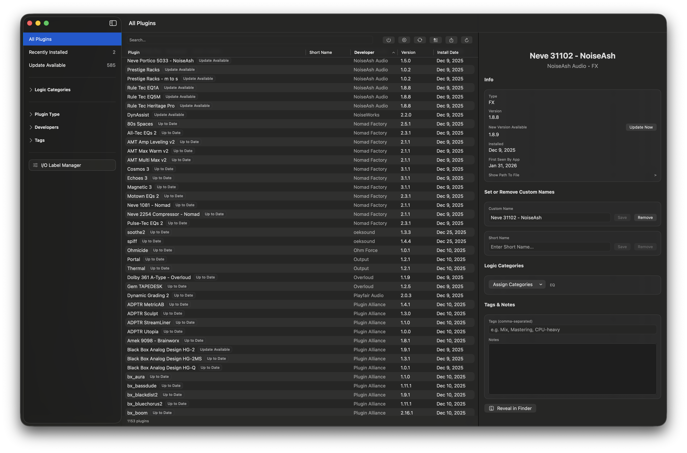
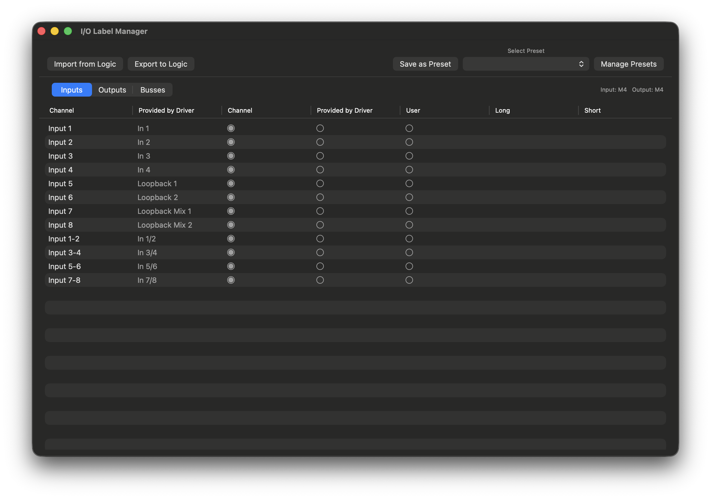

# Overview

>Note - Not available yet. Final stages of documentation writing and prepping release version.

Aurora is a Plugin Manager (AU) and I/O Manager, built specifically for Logic Pro.</p>



## Features

- Add, edit and remove custom plugin names & short names without having to open Logic.
- Add, edit, remove and assign plugins to Logic categories without having to open Logic. 
- Fully-fledged I/O label editor including the ability to import and export presets, allowing you to easily switch between I/O setups when working on different projects.
- KVR Studio Manager integration for displaying update availability.
- Searchable per-plugin tags and notes.
- Comprehensive search and filter.
- Customizable CSV export.
- Light/Dark Mode support.



## Why do I need this?

1. Aurora is designed exclusively for **fast macOS & Logic integration**. No 'deep scans' or full plugin initialization required; if you've installed it, it's in Aurora.
2. Aurora lets you add, edit and remove custom plugin names, short names and plugin categories without having to open Logic
3. Aurora is a fully-fledged I/O label editor. You can use it to changes the labels of your inputs, outputs and busses. You can also save, export and import I/O label presets, allowing for easy switching between different I/O & bus configurations.
4. Aurora can pull data directly from KVR Studio Manager, allowing additional information such as whether or not an update is available to be displayed at a glance. This feature is completely optional.

## Why choose Aurora over other plugin managers?

1. Most other plugin managers are ugly and slow because they have to cater to multiple plugin formats, DAWs and operating systems.
2. A lot of the other plugin managers I tested during R&D are essentially just glorified finder windows - they contain no features that are actually useful and often charge for the privilege.
<br>

# Usage

## Requirements

Minimum Requirements (assumed, not tested):

 - macOS Sonoma 14.x
 - Logic Pro 10.x
 - KVR Studio Manager 0.3.x (optional)

Aurora has been tested and confirmed as working on the following software and OS versions:

 - macOS Tahoe 26.2 (U2B)
 - Logic Pro 11.x
 - Logic Pro 12.x (Creator Studio)
 - Logic Pro 12.x (Standalone)
 - KVR Studio Manager 0.3.0.1 + (optional)

## Installation

0. (If you want Aurora to show whether plugin updates are available) Install KVR Studio Manager, open it and run a scan. This step is completely optional.
1. Download the latest release and unzip.
2. Drag Aurora into your Applications folder.
3. Right-click -> Open
4. Depending on your Gatekeeper configuration, you might be prompted to open System Preferences -> Privacy and Security -> Open Anyway.
5. Be aware that Aurora is currently in Alpha. There may be significant bugs. I advise against using it with any Logic installation where you can't risk losing custom names, preferences or I/O labels.

### General Usage

- See the [Wiki](https://github.com/elrevert/Aurora/wiki/User-Guide) for a comprehensive user guide.
<br>

# More Info

## FAQ

### I want to help out with Alpha testing, how can I do this?

Just use the app and report any bugs you find. The main goal of the alpha is to test Aurora with as many different audio interfaces as possible.
<br>
<br>

### VST / AAX / (Insert DAW here) support when?

Never, sorry. Read the first line of this readme again. If I were to release something that would work with different plugin formats in the future, it would be an entirely different app with a different name.
<br>
<br>

### Changes I've made in Aurora aren't appearing in Logic?

Restart Logic.
<br>
<br>

### Why is Aurora unsigned? Why does macOS tell me that it can't be scanned for malware? Is it risky for me to run? Why haven't you uploaded the source code?

No, it's not risky at all. A couple of points regarding this topic:

- Aurora (obviously) does not contain malware. The reason macOS shows this warning is purely because I don't pay for the apple developer program - I can't justify the cost of it against releasing a single app that is essentially freeware. 

- Aurora is not (and never will be) open source. The reason for this is that some 'developers' in this space seem to have a habit of ripping off features from other apps and then charging for them. If you really want to take a look at the source code, let me know and I'll send it to you. 

If you feel like either of these answers are a problem, don't use Aurora.
<br>
<br>

### Why the annoying Donationware window?

I'm a full-time mixing and mastering engineer. I initially started developing Aurora to solve problems in my own personal workflow that needed fixing. During early development, it became clear fairly quickly that the app would likely be useful to more people than just myself.

The issue with releasing the app publicly as pure freeware is this; bug reports. Bug reports that I will have to deal with. Bug reports that I can't reasonably justify spending time dealing with for free. 

The truth is, if Aurora doesn't receive enough donations to justify spending that time, I simply will not be able to keep it maintained. 
<br>
<br>

### Why does Aurora need KVR Studio Manager to be installed for the plugin update features to function? Can't you get Aurora to look for available updates without the hassle of having to install a separate app?

In short, no. I looked into this during development and quickly realized that it wasn't even close to viable. KVR doesn't expose its API publicly (you have to log in), so this would require Aurora to constantly scrape KVR's public-facing website directly for update information, which would almost certainly hit the rate limit within seconds. Even if I was able to implement some sort of KVR account linking feature, there's also the issue of accurately matching scanned AUs to the correct entries in the KVR database (equally as 'not viable').

KVR Studio Manager already does what we need and it does it far better than anything I could possibly build (even if I had the time). Aurora is not (and will never be) a replacement for KVR Studio Manager - it's a companion, intended to streamline the experience for Logic users. 
<br>
<br>


## Upcoming Features / Roadmap

- Ability to delete unwanted architectures from plugins (ARM/Intel).
- Full 'backup and restore' functionality across plugins and I/O.

## Known Bugs & Limitations

- Column size is reset to default when toggling the Hide Badges option in Settings (SwiftUI Table limitation).
- Column size is not persisted between launches (SwiftUI Table limitation). 
- 'Update Now' button will link to whatever KVR SM links to - usually either a direct download or the vendor website.
- Regarding the 'Provided by Driver' names for stereo output pairs: Aurora is using educated guesswork to pull these. Unique names for stereo pairs aren't a thing in CoreAudio (as far as I'm aware, could be wrong) so I've tried to emulate how Logic comes up with them as best I can. Incorrect names might be pulled for the literally thousands of audio interfaces that I haven't personally tested. The names for mono channels should always be correct as they are being pulled direct from source.

## Untested Features

- Status message for when I/O rows are skipped while applying a preset due to missing channels. 
- All Batch Features (Menu Bar -> Edit) apart from short names (which works fine).
- Some of the Settings Menu functionality when the Logic integrations are not linked on initial launch.

## Regarding Bug Support

I built this primarily for my own personal use as a full-time mix engineer. While I will *try* to provide bug support where I can, I'm not a software engineer. Feel free to make suggestions for features but whether or not they will be implemented will be determined entirely by how much I would personally value them and if they match my workflow. 


## Changelog
```
2026-02-04 V0.25 - Initial alpha release.
```
